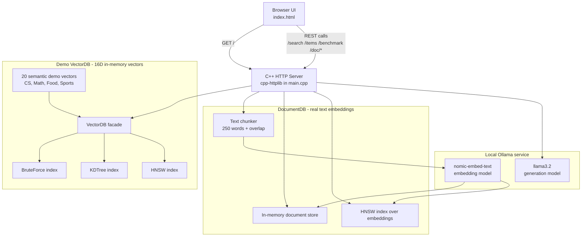
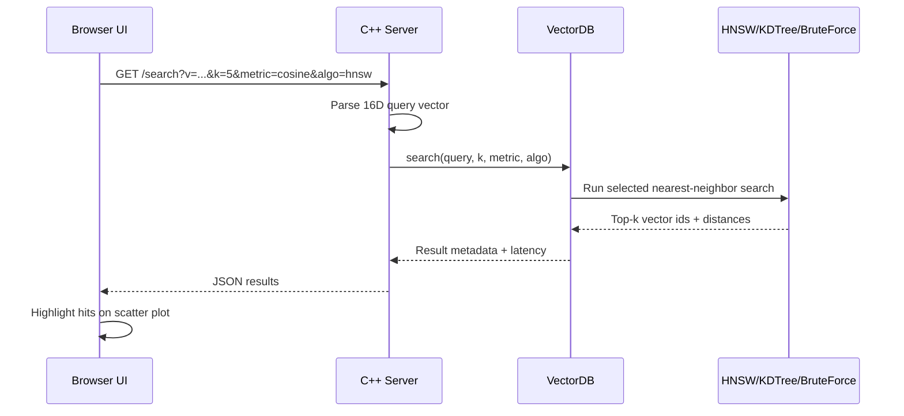
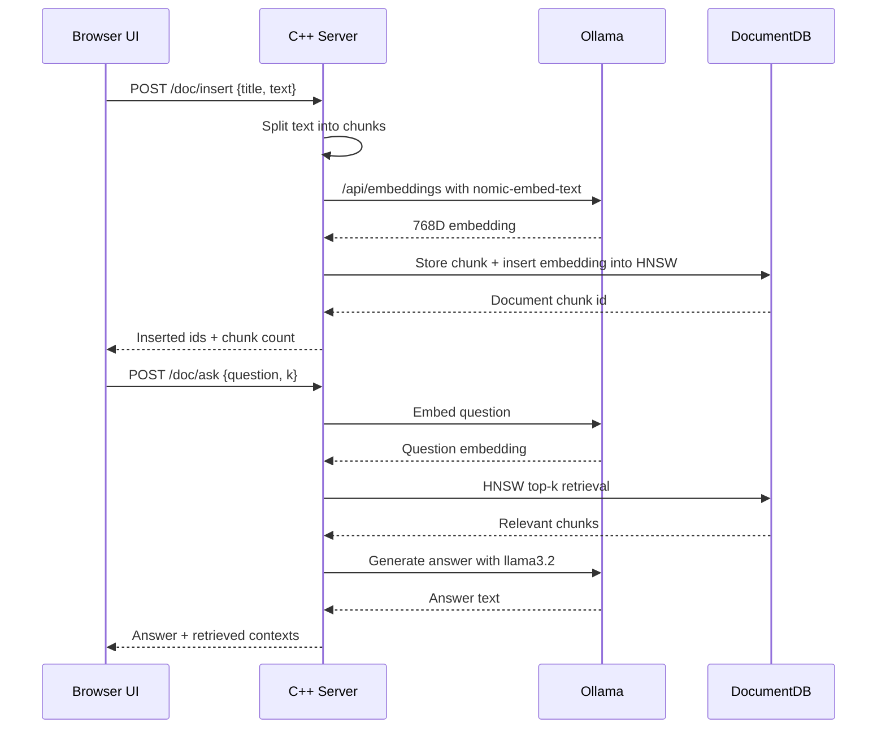

# VectorDB - Build a Vector Database from Scratch in C++

A fully working educational vector database built from scratch in C++ with a browser UI, REST API, multiple search algorithms, and a local RAG pipeline powered by Ollama.

This project is intentionally compact: the backend, vector indexes, API routes, document chunking, Ollama client, and web server all live in `main.cpp`; the UI lives in `index.html`; and `httplib.h` provides the single-header HTTP server.

> Goal: understand how production vector databases such as Pinecone, Weaviate, Chroma, Milvus, and Qdrant work under the hood by building the important pieces yourself.

---

## Table of Contents

- [Features](#features)
- [High-Level Architecture](#high-level-architecture)
- [Request Flows](#request-flows)
- [Project Structure](#project-structure)
- [Prerequisites](#prerequisites)
- [Quick Start on Windows](#quick-start-on-windows)
- [Running the Application](#running-the-application)
- [Using the Web UI](#using-the-web-ui)
- [REST API Reference](#rest-api-reference)
- [Core Components](#core-components)
- [Algorithm Notes](#algorithm-notes)
- [Configuration](#configuration)
- [Troubleshooting](#troubleshooting)
- [Learning Roadmap](#learning-roadmap)
- [License](#license)

---

## Features

| Feature | Description |
|---|---|
| Multiple search algorithms | HNSW, KD-Tree, and Brute Force are implemented side by side. |
| Multiple distance metrics | Cosine distance, Euclidean distance, and Manhattan distance. |
| Demo vector database | Includes 20 preloaded 16-dimensional semantic demo vectors. |
| Live algorithm comparison | Run all algorithms on the same query and compare latency. |
| PCA-style visualization | `index.html` renders a 2D scatter plot of the semantic space. |
| Real document embeddings | Paste text and embed it locally with Ollama's `nomic-embed-text`. |
| RAG pipeline | Ask questions over inserted documents using retrieval + `llama3.2`. |
| REST API | Search, insert, delete, benchmark, inspect HNSW, and run document RAG. |
| Local-first | No hosted database or cloud AI API is required. |

Important runtime behavior:

- Demo vector search works even when Ollama is offline.
- Document embedding and Ask AI require Ollama to be running.
- All data is in memory; inserted demo vectors and documents reset when the server restarts.
- The server listens on port `8080`.
- The Ollama client expects Ollama on `127.0.0.1:11434`.

---

## High-Level Architecture



The project has two separate vector workloads:

1. **Demo vectors:** fixed 16D vectors used to compare HNSW, KD-Tree, and Brute Force.
2. **Documents:** real text converted into model embeddings by Ollama and indexed with HNSW.

---

## Request Flows

### Demo Search Flow



### Document RAG Flow



---

## Project Structure

```text
VectorDB/
|-- main.cpp      # Backend, algorithms, REST API, Ollama client, static file serving
|-- httplib.h     # Single-header cpp-httplib dependency
|-- index.html    # Browser UI, scatter plot, tabs, API calls
|-- README.md     # Project documentation
|-- .gitignore    # Ignores compiled binaries and IDE files
```

There is no build system yet. The project currently compiles with a direct `g++` command.

---

## Prerequisites

For the full experience on Windows, install:

1. **MSYS2 UCRT64** - provides `g++`.
2. **Git** - useful for cloning/version control.
3. **Ollama** - runs the local embedding and generation models.

Minimum recommended system:

- Windows 10/11
- 8 GB RAM or more
- A few GB of free disk space for Ollama models
- Modern browser such as Chrome, Edge, Firefox, or Brave

Ollama models used by default:

| Purpose | Model | Used by |
|---|---|---|
| Embeddings | `nomic-embed-text` | `/doc/insert`, `/doc/search`, `/doc/ask` |
| Text generation | `llama3.2` | `/doc/ask` |

---

## Quick Start on Windows

### 1. Install MSYS2 and GCC

Download MSYS2 from:

```text
https://www.msys2.org
```

Install it to the default path:

```text
C:\msys64
```

Open **MSYS2 UCRT64** from the Start Menu and run:

```bash
pacman -Syu
```

If MSYS2 asks you to close and reopen the terminal, do that, then run:

```bash
pacman -S mingw-w64-ucrt-x86_64-gcc
```

Add this folder to your Windows PATH:

```text
C:\msys64\ucrt64\bin
```

Open a new PowerShell window and verify:

```powershell
g++ --version
```

### 2. Install Ollama and Pull Models

Download Ollama from:

```text
https://ollama.com
```

Then pull the required models:

```powershell
ollama pull nomic-embed-text
ollama pull llama3.2
```

Verify:

```powershell
ollama list
```

### 3. Compile the Server

From the repository folder:

```powershell
cd d:\Montas-AI
g++ -std=c++17 -O2 main.cpp -o db -lws2_32
```

Why `-lws2_32`?

- `cpp-httplib` uses sockets.
- On Windows, socket functions are provided by Winsock.
- `-lws2_32` links the required Winsock library.

The output should be:

```text
db.exe
```

### 4. Run the App

If Ollama is not already running:

```powershell
ollama serve
```

In another PowerShell window:

```powershell
cd d:\Montas-AI
.\db.exe
```

Open:

```text
http://localhost:8080
```

Expected startup output:

```text
=== VectorDB Engine ===
http://localhost:8080
20 demo vectors | 16 dims | HNSW+KD-Tree+BruteForce
Ollama: ONLINE
  embed model: nomic-embed-text  gen model: llama3.2
```

If it says `Ollama: OFFLINE`, the demo search still works, but document/RAG features will not.

---

## Running the Application

You usually need two processes:

| Process | Command | Required for |
|---|---|---|
| Ollama server | `ollama serve` | Document embeddings and Ask AI |
| VectorDB server | `.\db.exe` | Web UI and REST API |

The browser UI is served by the C++ server itself:

```text
GET http://localhost:8080/
```

The UI then calls the API configured in `index.html`:

```js
const API = 'http://localhost:8080';
```

---

## Using the Web UI

### Tab 1: Search

Use this tab to search the preloaded 16D demo vectors.

Good example queries:

- `binary tree`
- `neural network`
- `calculus`
- `sushi`
- `basketball`

What happens:

1. The UI maps the typed query into a simple 16D demo embedding.
2. The selected algorithm searches the demo vector database.
3. Results return with ids, metadata, categories, distances, and latency.
4. Matching points are highlighted on the scatter plot.

Use **Compare All Algos** to benchmark HNSW, KD-Tree, and Brute Force on the same query.

### Tab 2: Documents

Use this tab to insert real text documents.

Steps:

1. Enter a document title.
2. Paste notes, paragraphs, articles, or any plain text.
3. Click **Embed & Insert**.
4. The backend chunks the text into overlapping chunks.
5. Ollama embeds each chunk.
6. The chunks are stored in `DocumentDB` and indexed with HNSW.

Notes:

- Long documents are split into approximately 250-word chunks.
- Chunks overlap by roughly 30 words.
- The document database is in memory only.

### Tab 3: Ask AI

Use this tab after inserting documents.

Steps:

1. Ask a question.
2. The backend embeds your question.
3. HNSW retrieves the most relevant document chunks.
4. The chunks are placed into a prompt.
5. Ollama's `llama3.2` generates the final answer.

The UI also shows which chunks were used as context.

---

## REST API Reference

Base URL:

```text
http://localhost:8080
```

### Demo Vector Endpoints

| Method | Endpoint | Description |
|---|---|---|
| `GET` | `/` | Serves `index.html`. |
| `GET` | `/items` | Lists all demo vectors. |
| `GET` | `/search?v=f1,f2,...&k=5&metric=cosine&algo=hnsw` | Runs nearest-neighbor search. |
| `POST` | `/insert` | Inserts a new 16D demo vector. |
| `DELETE` | `/delete/:id` | Deletes a demo vector by id. |
| `GET` | `/benchmark?v=...&k=5&metric=cosine` | Compares Brute Force, KD-Tree, and HNSW. |
| `GET` | `/hnsw-info` | Returns HNSW layers, nodes, and edges. |
| `GET` | `/stats` | Returns demo database stats. |

Supported values:

| Parameter | Values |
|---|---|
| `algo` | `hnsw`, `kdtree`, `bruteforce` |
| `metric` | `cosine`, `euclidean`, `manhattan` |
| `k` | Number of nearest neighbors to return |
| `v` | Comma-separated 16D vector |

Example search:

```powershell
curl "http://localhost:8080/search?v=0.9,0.8,0.7,0.6,0.1,0.1,0.1,0.1,0.1,0.1,0.1,0.1,0.1,0.1,0.1,0.1&k=3&metric=cosine&algo=hnsw"
```

Example insert:

```powershell
curl -X POST http://localhost:8080/insert `
  -H "Content-Type: application/json" `
  -d '{"metadata":"Graph algorithms example","category":"cs","embedding":[0.9,0.8,0.7,0.6,0.1,0.1,0.1,0.1,0.1,0.1,0.1,0.1,0.1,0.1,0.1,0.1]}'
```

Example benchmark:

```powershell
curl "http://localhost:8080/benchmark?v=0.9,0.8,0.7,0.6,0.1,0.1,0.1,0.1,0.1,0.1,0.1,0.1,0.1,0.1,0.1,0.1&k=5&metric=cosine"
```

### Document and RAG Endpoints

| Method | Endpoint | Body | Description |
|---|---|---|---|
| `POST` | `/doc/insert` | `{"title":"...","text":"..."}` | Chunks, embeds, and stores a document. |
| `GET` | `/doc/list` | none | Lists stored document chunks. |
| `DELETE` | `/doc/delete/:id` | none | Deletes a document chunk. |
| `POST` | `/doc/search` | `{"question":"...","k":3}` | Retrieves relevant chunks without generating an answer. |
| `POST` | `/doc/ask` | `{"question":"...","k":3}` | Runs full RAG: embed, retrieve, generate. |
| `GET` | `/status` | none | Returns Ollama and database status. |

Example document insert:

```powershell
curl -X POST http://localhost:8080/doc/insert `
  -H "Content-Type: application/json" `
  -d '{"title":"Dynamic Programming Notes","text":"Dynamic programming solves problems by breaking them into overlapping subproblems and storing the results to avoid recomputation."}'
```

Example retrieval-only search:

```powershell
curl -X POST http://localhost:8080/doc/search `
  -H "Content-Type: application/json" `
  -d '{"question":"What is dynamic programming?","k":3}'
```

Example RAG question:

```powershell
curl -X POST http://localhost:8080/doc/ask `
  -H "Content-Type: application/json" `
  -d '{"question":"What is dynamic programming?","k":3}'
```

Example status:

```powershell
curl http://localhost:8080/status
```

---

## Core Components

### `main.cpp`

Contains the backend and all core logic:

| Component | Responsibility |
|---|---|
| `VectorItem` | Stores id, metadata, category, and vector embedding. |
| Distance functions | Implements Euclidean, cosine, and Manhattan distance. |
| `BruteForce` | Exact linear scan baseline. |
| `KDTree` | Axis-splitting nearest-neighbor structure for low-dimensional vectors. |
| `HNSW` | Approximate nearest-neighbor graph index. |
| `VectorDB` | Facade that keeps Brute Force, KD-Tree, and HNSW in sync. |
| `OllamaClient` | Calls local Ollama `/api/embeddings` and `/api/generate`. |
| `DocumentDB` | Stores document chunks and indexes their embeddings. |
| HTTP routes | Exposes the REST API and serves `index.html`. |

### `index.html`

Contains the complete frontend:

| Area | Responsibility |
|---|---|
| Search tab | Query demo vectors and display top-k matches. |
| Documents tab | Insert real text documents through Ollama embeddings. |
| Ask AI tab | Run RAG over inserted documents. |
| Scatter plot | Visualize demo vectors in 2D. |
| API layer | Calls `http://localhost:8080` endpoints with `fetch`. |

### `httplib.h`

Provides the embedded HTTP server and client support.

The project uses it for two things:

1. Hosting the local REST API and web UI.
2. Making HTTP requests from C++ to Ollama.

---

## Algorithm Notes

### Brute Force

Brute Force compares the query vector against every stored vector.

Pros:

- Simple.
- Exact.
- Excellent correctness baseline.

Cons:

- Search cost grows linearly with item count.
- Slow for large databases.

Approximate complexity:

```text
O(N * d)
```

where `N` is the number of vectors and `d` is the vector dimension.

### KD-Tree

KD-Tree recursively partitions vector space by splitting on one dimension at a time.

Pros:

- Exact for this implementation.
- Good educational example for spatial search.
- Works reasonably well for low-dimensional data.

Cons:

- Suffers from the curse of dimensionality.
- Performs poorly on high-dimensional embeddings such as 768D model vectors.

Best fit:

- Small or medium datasets.
- Low-dimensional vectors, roughly 2D to 20D.

### HNSW

HNSW means **Hierarchical Navigable Small World**.

It builds a multi-layer graph:

- Layer 0 contains the most nodes.
- Higher layers contain fewer nodes.
- Search starts at the sparse top layer.
- The algorithm greedily moves closer to the query.
- It then descends layer by layer until it reaches layer 0.

Pros:

- Fast approximate nearest-neighbor search.
- Works well in high-dimensional spaces.
- Similar conceptually to indexes used by real vector databases.

Cons:

- More complex than Brute Force and KD-Tree.
- Results are approximate.
- Insert and graph maintenance require more logic.

In this project:

- HNSW is used for demo vectors.
- HNSW is also used for real document embeddings.
- `/hnsw-info` exposes graph structure for learning/debugging.

### Distance Metrics

| Metric | Intuition | Common use |
|---|---|---|
| Cosine | Measures angle between vectors. | Semantic embeddings. |
| Euclidean | Straight-line distance. | Spatial/numeric vectors. |
| Manhattan | Sum of absolute differences. | Grid-like or sparse features. |

For text embeddings, cosine distance is usually the most useful default.

---

## Configuration

Current defaults are hardcoded for clarity.

| Setting | Location | Default |
|---|---|---|
| Demo vector dimension | `main.cpp` | `16` |
| Server bind address | `main.cpp` | `0.0.0.0` |
| Server port | `main.cpp` | `8080` |
| Ollama host | `main.cpp` | `127.0.0.1` |
| Ollama port | `main.cpp` | `11434` |
| Embedding model | `main.cpp` | `nomic-embed-text` |
| Generation model | `main.cpp` | `llama3.2` |
| Frontend API URL | `index.html` | `http://localhost:8080` |
| Document chunk size | `main.cpp` | `250` words |
| Chunk overlap | `main.cpp` | `30` words |

### Use a Smaller/Faster LLM

If `llama3.2` is slow on your machine, pull a smaller model:

```powershell
ollama pull llama3.2:1b
```

Then change the generation model in `main.cpp`:

```cpp
std::string genModel = "llama3.2:1b";
```

Recompile and restart:

```powershell
g++ -std=c++17 -O2 main.cpp -o db -lws2_32
.\db.exe
```

---

## Troubleshooting

| Problem | Likely cause | Fix |
|---|---|---|
| `g++: command not found` | MSYS2 GCC is not installed or not on PATH. | Install MSYS2 UCRT64 GCC and add `C:\msys64\ucrt64\bin` to PATH. |
| `undefined reference to WSA...` | Missing Winsock link flag on Windows. | Compile with `-lws2_32`. |
| Browser cannot reach app | Server is not running. | Start `.\db.exe` and open `http://localhost:8080`. |
| `Ollama: OFFLINE` | Ollama service is not running. | Run `ollama serve`. |
| `/doc/insert` returns Ollama error | Missing model or Ollama offline. | Run `ollama pull nomic-embed-text` and start Ollama. |
| `/doc/ask` is slow | Local LLM generation can be CPU-heavy. | Use `llama3.2:1b` or wait for completion. |
| Port 8080 already in use | Another process owns the port. | Run `netstat -ano \| findstr 8080`, then `taskkill /PID <pid> /F`. |
| Inserted documents disappear | Data is stored in memory. | This is expected after restart. Add persistence if needed. |

### Check Port 8080

```powershell
netstat -ano | findstr 8080
```

### Kill a Process on Port 8080

```powershell
taskkill /PID <pid> /F
```

### Check Ollama

```powershell
ollama list
curl http://localhost:11434/api/tags
```

### Check VectorDB Server

```powershell
curl http://localhost:8080/status
curl http://localhost:8080/items
```

---

## Learning Roadmap

If you want to extend this project, good next steps are:

1. **Persistence:** save vectors/documents to disk and reload on startup.
2. **Build system:** add `CMakeLists.txt` or a simple `Makefile`.
3. **Config file:** move model names, ports, and chunk sizes out of source code.
4. **Better JSON parsing:** replace manual string parsing with a JSON library.
5. **Streaming answers:** stream Ollama output token-by-token to the UI.
6. **Larger benchmarks:** generate thousands of vectors and compare algorithm scaling.
7. **Metadata filters:** filter search by category, source, date, or tags.
8. **Persistent HNSW:** serialize and deserialize the graph index.
9. **Hybrid search:** combine keyword matching with vector search.
10. **Tests:** add unit tests for distance metrics, parsing, indexes, and API routes.

---

## License

MIT - use this however you want.
